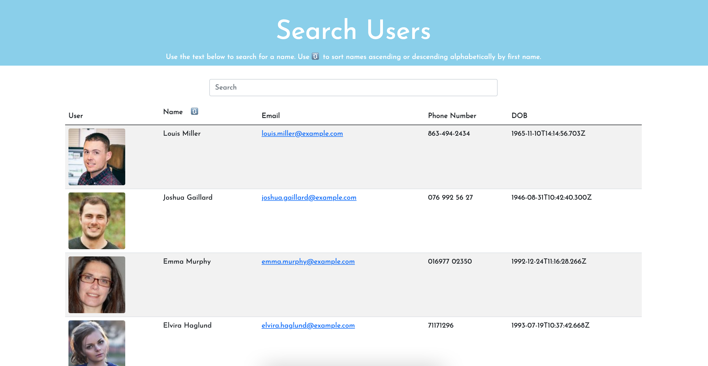

# Employee Directory READme

## Description
The employee directory allows for a list of employees to easily be filtered through with search criteria. Users should be able to view the entire employee directory at once so that I have quick access to their information. An employee or manager would benefit greatly from being able to view non-sensitive data about other employees in this manner and it is particularly helpful to be able to filter employees by name.

## Table of Contents
- [Installation](#installation)
- [Usage](#usage)
- [Contact](##questions?)

## Installation
To install necessary dependencies, run the following command:

    npm i

## Usage
Use the text box/search area below to search for a name. Use 🔃 to sort names ascending or descending alphabetically by first name.

### Demo

---  

## Questions?
If you come across any issues with the repo, please open an issue, or contact me directly at: anth8nyc@gmail.com. More of my work is avaiable on GitHub at [anth8nyc](https://github.com/anth8nyc/).

